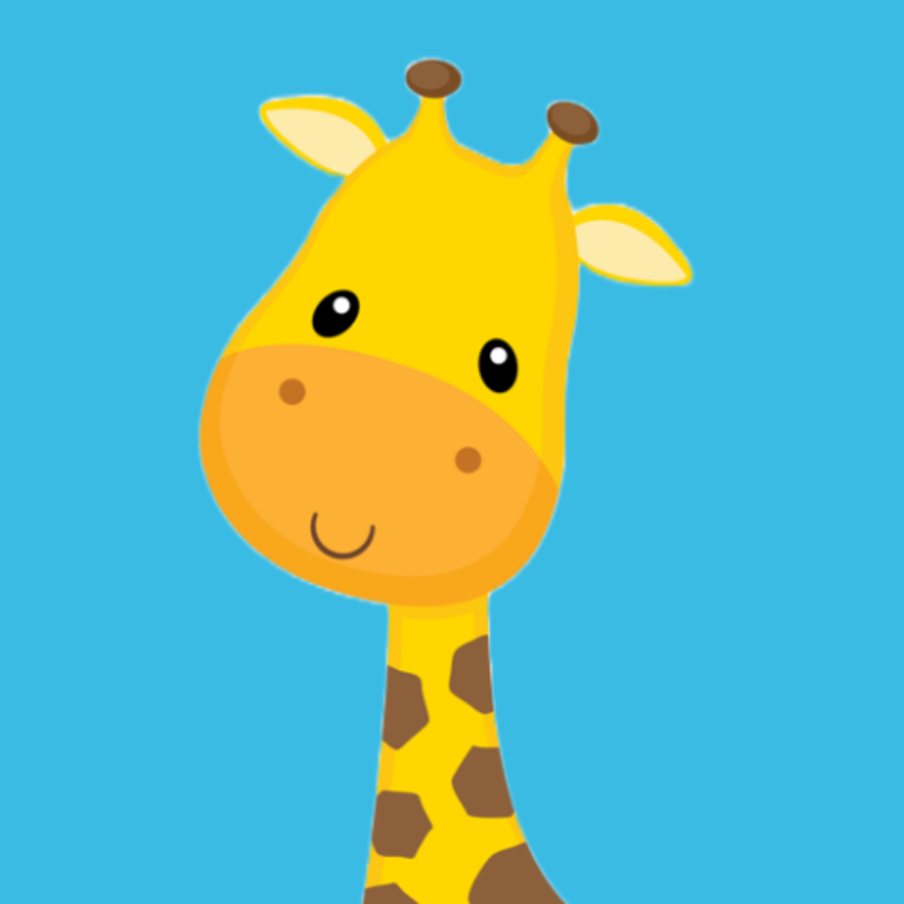

<!-- PROJECT LOGO -->

# <h3>   BabyGiraffe  
<a href="">Test-Flight</a>     </h3>

## How did we come up with this idea :

We wanted to create a game that is easy for children to play and learn from it.
Main challenge:

Was how can we create a game that helps children learn colors in a fun way.
Problem Statement :

After researching we notice that children always love to play games especially with the advancement of technology, there are few games that integrate learning and play at the same time , for example one of the many children's games that we notice by researching that they like to play this type of game :
<h3 align="left"></h3>

##Solution Concept :

So we came up with a solution for a small children's game that combines play and learning together in a simple way to help motivate them to learn new colors so that can enhance their developing.
Technologies & Tools:

We create our game using ![SwiftUI][SwiftUI-img] ![Sketch][Sketch-img]
Here is a link for the design :
https://sketch.com/s/8ca935b2-e158-42f0-b21d-5147086d3935

## Demo for our game:

The first demo is for localization feature as you can see the game supports both the Arabic and English languages :
https://drive.google.com/drive/folders/1a4NDh2UKYR-xCf_4HVKu5qcWw_KijeLY?usp=sharing

The second demo is for accessibility feature as you can see we add the "Reduce Motion" accessibility into the game :
https://drive.google.com/drive/folders/1AQYWdiX6f6K_L7_FnhO4QCAx0Nw29mHn?usp=sharing

## Challenge Summary:

In the beginning, when we started creating the mini-educational game for children, we tried to benefit the largest number of children, so we added accessibility, we had difficulty with Any feature that is appropriate for the application, so we decided to reduce motion, applied it, and added localization in to benefit many children.
Team:

<a href="http://linkedin.com/in/salma-alorifi-0544801a6/"> Salma Alorifi </a> -

<!-- MARKDOWN LINKS & IMAGES -->
<a href="https://www.linkedin.com/in/wadiah-336306181?original_referer="> Wadiah Albuhairi </a> -
<!-- https://www.markdownguide.org/basic-syntax/#reference-style-links -->

<!-- MARKDOWN LINKS & IMAGES -->

keyboard_arrow_up

Accessibility Demo - Google Drive

